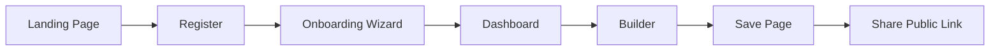
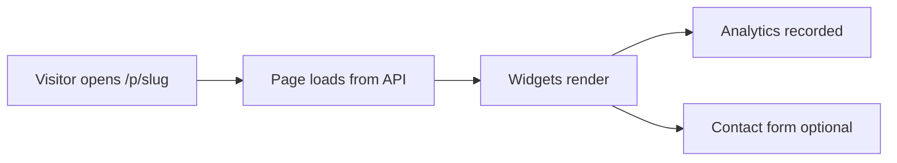
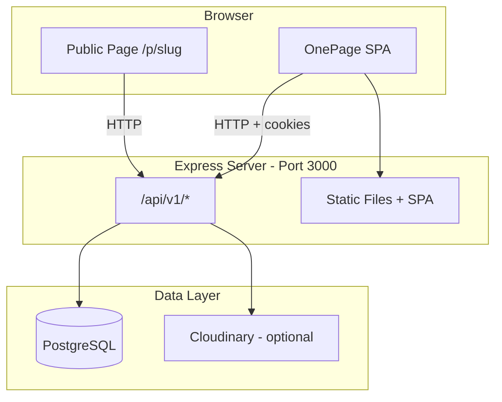

# 00 — Project Overview

**Audience:** Beginners who know HTML, CSS, JavaScript, and Express basics.  
**Prerequisites:** None — start here.  
**What you will learn:** What OnePage is, who it serves, what problem it solves, and how the application works from a user's perspective.

**Read next:** [01 — Full Architecture Guide](01_FULL_ARCHITECTURE_GUIDE.md)

---

## What Is OnePage?

**OnePage** is a personal website builder. It lets you create a single-page portfolio — a professional online presence with sections like "About Me," "Projects," "Skills," and a contact form — without writing HTML from scratch.

You sign up, pick a theme, arrange **widgets** (pre-built content blocks) in a visual **builder**, and share a public link like:

```
https://yoursite.com/p/your-name
```

OnePage is built as a **full-stack web application**:

- A **frontend** (what runs in the browser) for the landing page, dashboard, builder, and public pages
- A **backend** (a server running Node.js and Express) that handles authentication, saves data, and serves the app in production
- A **database** (PostgreSQL) that stores users, pages, widgets, and analytics

---

## Who Is OnePage For?

| User | How they use OnePage |
|------|----------------------|
| **Developers & creators** | Build a portfolio to share with employers, clients, or communities |
| **Students** | Learn how a real full-stack app is structured by studying and extending this project |
| **Visitors** | View someone's public page at `/p/their-slug` without needing an account |

---

## What Problem Does OnePage Solve?

Creating a personal website from scratch requires:

1. Writing HTML and CSS for every section
2. Hosting static files somewhere
3. Manually updating content when things change
4. Building contact forms, analytics, and themes yourself

OnePage removes most of that friction:

- **Visual builder** — add and edit sections without coding
- **Themes** — six ready-made visual styles (light, dark, linear, glass, forest, ocean)
- **Hosted in one app** — sign up, build, publish; your page is live at your slug
- **Analytics** — see how many people viewed your page
- **Export** — download your site as a ZIP file

---

## How the Application Works (User Perspective)

### Journey 1: A New User Signs Up



1. **Landing page** (`/`) — marketing page explaining OnePage
2. **Register** (`/register`) — create an account with email and password
3. **Onboarding** (`/onboarding`) — 4-step wizard: your name, public URL slug, theme, preview
4. **Dashboard** (`/dashboard`) — overview with stats, public link, quick actions
5. **Builder** (`/builder`) — drag-free visual editor to add and configure widgets
6. **Save** — widgets are stored in the database
7. **Share** — visitors open `/p/your-slug`

### Journey 2: A Visitor Views a Public Page



The visitor does not need to log in. The browser fetches page data from the API and renders widgets with the owner's chosen theme.

### Journey 3: A Returning User Edits Their Page


---

## Core Features

### Authentication
- Register, login, logout
- Sessions managed with **JWT tokens** stored in **httpOnly cookies** (explained in [Chapter 07](07_SECURITY_GUIDE.md))

### Onboarding Wizard
After registration, new users complete four steps:

1. **About you** — name and job title
2. **Your link** — choose a unique URL slug (`/p/your-name`)
3. **Pick a theme** — select from six themes
4. **Preview & launch** — review seeded starter page, go to dashboard or builder

On completion, the server creates **starter widgets** (Hero, About, Skills, Projects, Social, Contact) personalized with the user's info.

### Visual Page Builder
Nine widget types:

| Widget | Purpose |
|--------|---------|
| Hero | Headline, subtitle, call-to-action button |
| About | Bio and profile text |
| Projects | Showcase work with images and links |
| Skills | Skill bars with proficiency levels |
| Gallery | Image grid with lightbox |
| Social | Links to GitHub, LinkedIn, etc. |
| Contact | Contact form (live on public pages) |
| Resume | Download link for resume/CV |
| Divider | Visual separator between sections |

### Themes
Six themes controlled by CSS custom properties (`data-theme` attribute):

- `light`, `dark`, `linear`, `glass`, `forest`, `ocean`

The app dashboard always uses the light brand theme. Public pages use the owner's selected theme.

### Analytics
First-party page view tracking — no Google Analytics. Each visit to a public page increments a daily view counter. Owners see a 7-day chart on the Analytics page.

### Additional Features
- **Appearance page** — change theme with live preview
- **Settings** — edit profile, username, slug
- **Export** — download site as ZIP from the builder
- **Admin panel** — list all users (admin role only)
- **Optional integrations** — Cloudinary (image hosting), OpenAI (AI bio), SMTP (contact email delivery)

---

## Application Component Map



---

## Development vs Production

| Aspect | Development | Production |
|--------|-------------|------------|
| Frontend | Vite dev server (port 5173) | Built files in `client/dist`, served by Express |
| Backend | Express (port 3000) | Same Express server |
| Database | Local or hosted PostgreSQL | Hosted PostgreSQL (e.g. Render) |
| Command | `npm run dev` | `npm run build` then `npm start` |

In development, two servers run. Vite proxies API requests to Express. In production, one Node process serves everything.

---

## Key Takeaways

- OnePage is a **personal website builder** with a visual editor, themes, and public URLs
- Users **register → onboard → build → share**; visitors view pages without logging in
- The app is **full-stack**: browser SPA + Express API + PostgreSQL database
- Widgets are the building blocks; themes control visual style
- Optional services (Cloudinary, OpenAI, SMTP) enhance features but are not required

---

## Mini Exercise

1. Run `npm run dev` and open http://localhost:5173
2. Click through the landing page without signing up
3. Register a test account and complete onboarding
4. Open your public page at `/p/your-chosen-slug` in a new tab
5. Write down three things that happened in the browser vs three things that must have happened on the server
