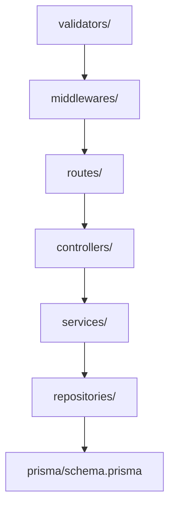

# 02 — Folder Structure Guide

**Audience:** Beginners learning how real projects organize code.  
**Prerequisites:** [01 — Full Architecture Guide](01_FULL_ARCHITECTURE_GUIDE.md)  
**What you will learn:** What every folder is for, why files are placed where they are, and common beginner mistakes.

**Read next:** [03 — Frontend Guide](03_FRONTEND_GUIDE.md) or [05 — Database Guide](05_DATABASE_GUIDE.md)

---

## Why Folders Matter

Folders are not random. They group related files so you can:

- Find code quickly
- Understand responsibility at a glance
- Avoid naming collisions
- Scale the project as it grows

OnePage uses an **npm workspaces monorepo** — one repository with multiple packages (`client` and `server`) that share a root `node_modules`.

---

## Root Level

```
OnePage/
├── client/          # Frontend SPA (Vite workspace)
├── server/          # Backend API (Express workspace)
├── docs/            # This educational documentation
├── logo/            # Source logo image files
├── scripts/         # Root-level utility scripts
├── index.js         # Production entry (migrations + server)
├── package.json     # Monorepo root scripts and workspaces
├── render.yaml      # Render.com deployment config
├── README.md        # Quick start guide
└── BRAND_SYSTEM.md  # Design and brand guidelines
```

| File/Folder | Purpose |
|-------------|---------|
| [`index.js`](../index.js) | Production bootstrap: load env, run Prisma migrations, start Express. **Not used in dev** (`npm run dev` starts client + server separately). |
| [`package.json`](../package.json) | Defines workspaces, `dev`, `build`, `start` scripts. |
| [`render.yaml`](../render.yaml) | Infrastructure-as-code for Render hosting (Postgres + web service). |
| [`logo/`](../logo/) | Original logo PNGs. Optimized copies go to `client/public/logo/`. |
| [`scripts/`](../scripts/) | Root utilities like `optimize-logo.mjs` (Sharp image processing). |

---

## Client Folder (`client/`)

The entire frontend lives here.

```
client/
├── index.html           # Single HTML shell for the SPA
├── vite.config.js       # Vite dev server + API proxy
├── package.json         # Frontend scripts (dev, build, preview)
├── public/              # Static assets copied as-is (favicon, logos)
├── dist/                # Production build output (gitignored)
├── scripts/             # All application JavaScript
│   ├── app.js           # Entry: router, auth guards, boot
│   ├── api/             # HTTP client wrappers per domain
│   ├── builder/         # Builder-specific UI (properties panel)
│   ├── core/            # Router and global state
│   ├── pages/           # Route page components
│   ├── utils/           # Shared helpers (theme, toast, layout)
│   └── widgets/         # Widget classes (hero, about, etc.)
└── styles/              # CSS organized by layer
    ├── base/            # Variables, reset, typography
    ├── layout/          # Grid, container
    ├── components/      # Buttons, cards, modals, toasts
    ├── pages/           # Page-specific styles
    └── themes/          # Theme overrides (light, dark, etc.)
```

### Why `client/scripts/` not `client/src/`?

Both conventions exist. This project uses `scripts/` to signal "vanilla JS modules" distinct from a `src/` convention common in React/Vue apps. Either name works; consistency matters more than the label.

### Why CSS is not imported from JavaScript?

[`client/index.html`](../client/index.html) links each CSS file with `<link>` tags. This keeps styles visible, debuggable in DevTools, and avoids a build step for CSS in development. Vite still bundles them in production builds.

### `client/dist/` vs `client/public/`

| Folder | When used | Git |
|--------|-----------|-----|
| `public/` | Dev and prod — favicon, logos | Committed |
| `dist/` | Production only — Vite build output | Gitignored |

**Never edit `dist/` manually.** Run `npm run build` to regenerate.

---

## Server Folder (`server/`)

```
server/
├── .env.example         # Template for environment variables
├── package.json         # Backend dependencies and Prisma scripts
├── prisma/
│   ├── schema.prisma    # Database models
│   └── migrations/      # SQL migration history
├── uploads/             # Local image uploads (when Cloudinary off)
└── src/
    ├── app.js           # Express app configuration
    ├── server.js        # HTTP listener
    ├── config/          # Env, JWT, database, Cloudinary, mail
    ├── controllers/     # Request handlers (thin)
    ├── data/            # Starter template data for onboarding
    ├── middlewares/     # Auth, validation, upload, errors
    ├── repositories/    # Database access (Prisma calls)
    ├── routes/          # Express route definitions
    ├── services/        # Business logic
    ├── utils/           # Response helpers, etc.
    └── validators/      # Zod schemas
```

### Layer responsibilities



| Layer | Job | Example file |
|-------|-----|--------------|
| **routes/** | Map URL + method to handler | `authRoutes.js` |
| **controllers/** | Parse request, call service, send response | `authController.js` |
| **services/** | Business rules | `authService.js` — hash password, create user |
| **repositories/** | Database queries only | `userRepository.js` |
| **middlewares/** | Run before controller | `auth.js`, `validate.js` |
| **validators/** | Input shape rules (Zod) | `authValidator.js` |
| **config/** | Environment and SDK setup | `jwt.js`, `database.js` |

### Why `server/src/data/`?

Contains static starter widget templates used when onboarding completes. Separating seed data from service logic keeps [`onboardingService.js`](../server/src/services/onboardingService.js) readable.

---

## Docs Folder (`docs/`)

This educational documentation set. Kept separate from `README.md` so the README stays a quick start and the course can grow without cluttering the repo root.

---

## Common Beginner Mistakes

### 1. Editing `client/dist/` directly
Changes are overwritten on next build. Edit source in `client/scripts/` and `client/styles/`.

### 2. Putting `.env` secrets in frontend code
Environment variables in `server/.env` are server-only. Never put `JWT_SECRET` or `DATABASE_URL` in client JavaScript.

### 3. Running only the client in dev
`npm run dev` starts **both** Vite and Express. API calls fail if only port 5173 is running without the proxy target on 3000.

### 4. Confusing `scripts/` at root vs `client/scripts/`
- Root `scripts/` — build utilities (logo optimization)
- `client/scripts/` — frontend application code

### 5. Committing `node_modules/` or `dist/`
Both are in [`.gitignore`](../.gitignore). Use `npm install` and `npm run build` instead.

### 6. Creating database tables manually
Use Prisma migrations: `cd server && npx prisma migrate dev`. Manual SQL bypasses migration history.

### 7. Putting business logic in routes
Routes should only wire URLs to controllers. Logic belongs in services.

---

## Where to Add New Features

| Feature type | Where to add |
|--------------|--------------|
| New page | `client/scripts/pages/new.page.js` + route in `app.js` + CSS in `styles/pages/` |
| New widget | `client/scripts/widgets/new.widget.js` + register in `widgets/index.js` |
| New API endpoint | `routes/` → `controllers/` → `services/` → `repositories/` |
| New database table | `prisma/schema.prisma` → migration |
| New env variable | `server/.env.example` + `config/env.js` |

---

## Key Takeaways

- **Monorepo**: `client/` (frontend) + `server/` (backend) under one root
- **Frontend**: `scripts/` for JS, `styles/` for CSS, `index.html` as SPA shell
- **Backend**: layered `routes → controllers → services → repositories`
- **Never edit `dist/`**; never expose secrets in client code

---

## Mini Exercise

List five files you would touch to add a new "Testimonials" widget. Check your answer against the "Where to Add New Features" table.
