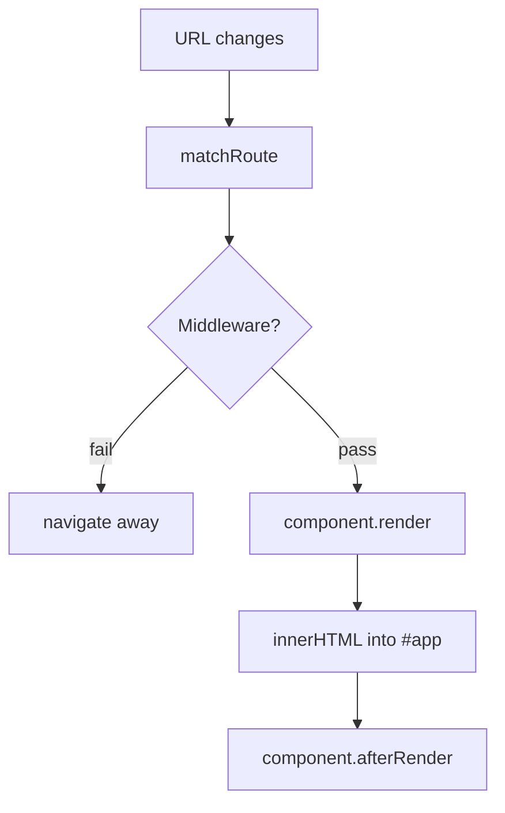
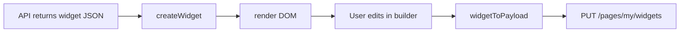

# 03 — Frontend Guide

**Audience:** Beginners learning single-page applications and component architecture.  
**Prerequisites:** [02 — Folder Structure Guide](02_FOLDER_STRUCTURE_GUIDE.md)  
**What you will learn:** How the OnePage frontend renders pages, handles events, manages state, and talks to the API.

**Read next:** [04 — Backend Guide](04_BACKEND_GUIDE.md)

---

## Single-Page Application (SPA)

### Definition
An **SPA** loads one HTML shell, then JavaScript swaps content as the user navigates — without full page reloads.

### How OnePage does it
1. Browser loads [`client/index.html`](../client/index.html)
2. [`app.js`](../client/scripts/app.js) runs on `DOMContentLoaded`
3. Router reads `window.location.pathname` and renders the matching page component into `<div id="app">`

### Why SPA
Smoother navigation, shared state (logged-in user), and app-like feel in the dashboard and builder.

### Alternative
Multi-page app (separate HTML files per route) — simpler but slower transitions and repeated asset loads.

---

## Pages

### Definition
A **page** is a screen the user sees: landing, login, dashboard, builder, public profile.

### Page module contract
Each file in [`client/scripts/pages/`](../client/scripts/pages/) exports:

```javascript
export const DashboardPage = {
  render(params) {
    return `<div class="dashboard">...</div>`;  // HTML string
  },
  async afterRender(params) {
    // Fetch data, bind click handlers, mount widgets
  },
};
```

| Method | When it runs | Purpose |
|--------|--------------|---------|
| `render` | First | Return HTML string |
| `afterRender` | After HTML inserted into DOM | Side effects: API calls, events |

### Route table
Defined in [`app.js`](../client/scripts/app.js):

| Path | Page | Middleware |
|------|------|------------|
| `/` | Landing | requireGuest |
| `/login`, `/register` | Auth | requireGuest |
| `/onboarding` | Onboarding | requireNotOnboarded |
| `/dashboard`, `/builder`, etc. | App pages | requireOnboarded |
| `/admin` | Admin | requireAdmin |
| `/p/:slug` | Public | None |

---

## Router

### Definition
A **router** maps URLs to page components.

### Implementation
[`client/scripts/core/router.js`](../client/scripts/core/router.js):

- `matchRoute(path)` — supports static paths and params (`:slug`)
- `handleRoute()` — runs middleware, calls `render` + `afterRender`
- `navigate(path)` — `history.pushState` + re-render



### Navigation
Links use `data-link` attribute; [`layout.js`](../client/scripts/utils/layout.js) binds clicks to `appRouter.navigate(href)` instead of full reloads.

---

## Auth Route Guards

Middleware functions in [`app.js`](../client/scripts/app.js):

| Guard | Behavior |
|-------|----------|
| `requireGuest` | Logged-in users redirected to dashboard/onboarding |
| `requireAuth` | Calls `GET /auth/me`; on failure → `/login` |
| `requireOnboarded` | Requires `profile.onboardingCompleted` |
| `requireNotOnboarded` | Onboarding-only access |
| `requireAdmin` | Requires `user.role === 'admin'` |

`refreshAuthUser()` in [`authRedirect.js`](../client/scripts/utils/authRedirect.js) populates `appState.user`.

---

## Components vs Widgets

| Term | Scope | Example |
|------|-------|---------|
| **Page component** | Full screen route | `DashboardPage`, `BuilderPage` |
| **Widget** | Content block on a portfolio page | `HeroWidget`, `ProjectsWidget` |
| **UI component** | Reusable styled element | Button, card, modal (CSS classes) |

---

## Widget System

### Widget class contract
Each widget in [`client/scripts/widgets/`](../client/scripts/widgets/):

```javascript
class HeroWidget {
  constructor(data) { this.data = data; }
  static fromJSON(data) { return new HeroWidget(data); }
  render() { /* returns DOM element */ }
  toJSON() { return { headline: ..., subtitle: ... }; }
  getPropertiesSchema() { return [ { key, label, type: 'text' }, ... ]; }
  update(newData) { /* re-render */ }
  destroy() { /* cleanup */ }
}
```

### Registry
[`widgets/index.js`](../client/scripts/widgets/index.js) maps type strings to classes:

- `createWidget('hero', data)` — factory
- `widgetToPayload(instance, order)` — serializes for API save

### Widget lifecycle



---

## Builder

[`builder.page.js`](../client/scripts/pages/builder.page.js) — three-panel layout:

| Panel | Purpose |
|-------|---------|
| Left sidebar | Add widgets from registry |
| Center canvas | Live preview of page |
| Right panel | Properties editor |

### Key behaviors
- **Load:** `pagesApi.getMyPage()`
- **Add widget:** `createWidget(type)` → append to canvas
- **Edit:** click widget → [`propertiesPanel.js`](../client/scripts/builder/propertiesPanel.js) renders schema-driven form
- **Reorder:** move up/down in properties panel
- **Save:** `pagesApi.saveWidgets()` with dirty-state tracking
- **Unsaved warning:** `beforeunload` + navigation guard on `[data-link]`
- **Export:** POST `/api/v1/export` with canvas HTML

### Properties panel
Schema types: `text`, `textarea`, `select`, `image`, `image-list`, `repeatable-list`, `action` (e.g. AI bio).

---

## Rendering and the DOM

### Definition
The **DOM** (Document Object Model) is the browser's tree representation of HTML. JavaScript can read and modify it.

### OnePage rendering
1. Page `render()` returns HTML **string**
2. Router sets `rootElement.innerHTML = html`
3. `afterRender()` queries DOM with `document.querySelector`, attaches listeners
4. Widgets return **DOM elements** appended to canvas

No virtual DOM framework — direct DOM manipulation.

---

## Events

User actions (clicks, form submit) are handled with:

```javascript
button.addEventListener('click', async () => { ... });
form.addEventListener('submit', (e) => { e.preventDefault(); ... });
```

Event delegation is used for dynamic lists (widget selection, gallery lightbox).

---

## Modules

### Definition
**ES modules** (`import`/`export`) split code into files loaded by the browser (with Vite bundling in production).

### Entry chain
`index.html` → `app.js` → pages, widgets, api, utils

Vite resolves imports and serves native modules in development.

---

## CSS Architecture

### Layers (load order in `index.html`)
1. **base/** — variables, reset, typography, motion
2. **layout/** — grid, container
3. **components/** — button, card, input, modal, toast
4. **pages/** — page-specific layouts
5. **themes/** — theme overrides

### Design tokens
[`styles/base/variables.css`](../client/styles/base/variables.css):

```css
--color-primary: #06B6D4;
--space-md: 1rem;
--radius-lg: 12px;
```

Components use `var(--color-primary)` so themes can override values.

---

## Theme System

### Three theme scopes

| Function | Used on | Effect |
|----------|---------|--------|
| `applyAppBrand()` | Dashboard, auth, builder chrome | Always light brand |
| `applyPublicTheme(name)` | `/p/:slug` | Full-page visitor theme |
| `applyScopedTheme(el, name)` | Builder canvas, appearance preview | Theme inside container only |

Themes set `data-theme="ocean"` on an element. CSS in [`styles/themes/`](../client/styles/themes/) overrides variables under `[data-theme="ocean"]`.

Metadata (labels, swatches): [`themes.config.js`](../client/scripts/utils/themes.config.js).

---

## Responsive Design

- Dashboard sidebar collapses on mobile
- Builder uses tab switching (Widgets | Preview | Properties) on small screens
- CSS media queries in layout and page styles
- Touch-friendly button sizes

---

## API Layer

### Structure
[`client/scripts/api/http.js`](../client/scripts/api/http.js) — base client  
Domain modules: `auth.api.js`, `pages.api.js`, `profile.api.js`, etc.

### Pattern
```javascript
export const pagesApi = {
  getMyPage() { return http.get('/pages/my'); },
  saveWidgets(widgets) { return http.put('/pages/my/widgets', { widgets }); },
};
```

Always `credentials: 'include'` for JWT cookie.

---

## State Management

### Global state
[`core/state.js`](../client/scripts/core/state.js):

```javascript
{ user, profile, widgets, projects, skills, theme }
```

- `get(key)`, `set(key, value)`, `subscribe(key, callback)`
- Exposed as `window.appState`

### Page-local state
Builder keeps `widgetInstances`, `isDirty`, `selectedWidget` on the page module — not in global state.

### Why not LocalStorage for auth?
JWT in httpOnly cookies is more secure (see [Chapter 07](07_SECURITY_GUIDE.md)). No sensitive tokens in `localStorage`.

---

## Public Page Rendering

[`public.page.js`](../client/scripts/pages/public.page.js):

1. `GET /pages/:slug`
2. `applyPublicTheme(page.themeName)`
3. Loop widgets → `createWidget()` → append to DOM
4. Contact widget: `live = true` enables form submission
5. Other widgets: inputs disabled (read-only)
6. `analyticsApi.recordView(slug)` — fire and forget
7. Entrance animations via CSS `animate-in` classes

---

## Key Takeaways

- Vanilla JS SPA with custom router and page components
- Widgets are class-based with registry, schema, and JSON serialization
- CSS layers + `data-theme` for theming
- Thin API modules over `fetch` with cookie auth
- Global state for user; page-local state for builder

---

## Mini Exercise

Add a `console.log` in `DashboardPage.afterRender` and list every API call it makes. Which could run in parallel?
