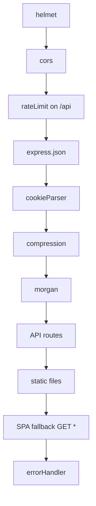
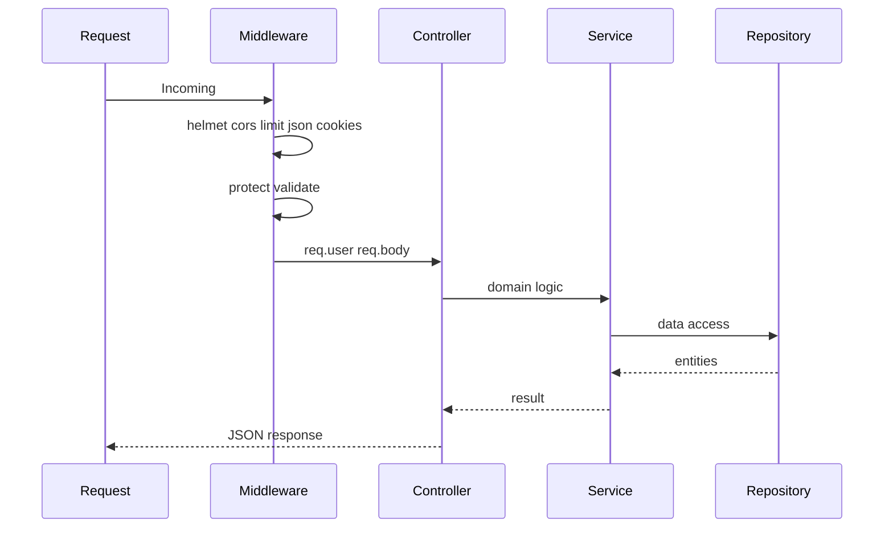

# 04 — Backend Guide

**Audience:** Beginners learning server-side architecture with Express.  
**Prerequisites:** [01 — Full Architecture Guide](01_FULL_ARCHITECTURE_GUIDE.md), [06 — API Guide](06_API_GUIDE.md)  
**What you will learn:** Server startup, middleware, routes, controllers, services, repositories, validation, uploads, and error handling.

**Read next:** [07 — Security Guide](07_SECURITY_GUIDE.md)

---

## Server Startup

### Production path
[`index.js`](../index.js) (root):

1. Load environment variables (skip local `.env` on Render)
2. Resolve and validate `DATABASE_URL`
3. Run `prisma migrate deploy` (with retries on hosted platforms)
4. Import and start [`server/src/server.js`](../server/src/server.js)

### Development path
`npm run dev` runs:
- `client`: Vite on port 5173
- `server`: `node --watch src/server.js` on port 3000

Dev does **not** use root `index.js` — migrations run manually.

### HTTP listener
[`server.js`](../server/src/server.js):
```javascript
app.listen(PORT, '0.0.0.0', () => {
  console.log(`Server running on port ${PORT}`);
});
```

`0.0.0.0` binds all network interfaces (required for Docker/Render).

---

## Express Application

[`server/src/app.js`](../server/src/app.js) configures middleware, routes, static files, SPA fallback, and error handler.

### Middleware order (matters!)



---

## Routes

### Definition
**Routes** map HTTP method + path to a handler function.

### Organization
One file per domain in [`server/src/routes/`](../server/src/routes/):

| File | Mount path |
|------|------------|
| `authRoutes.js` | `/api/v1/auth` |
| `pageRoutes.js` | `/api/v1/pages` |
| `profileRoutes.js` | `/api/v1/profile` |
| `analyticsRoutes.js` | `/api/v1/analytics` |
| `adminRoutes.js` | `/api/v1/admin` |
| `uploadRoutes.js` | `/api/v1/upload` |
| `aiRoutes.js` | `/api/v1/ai` |
| `exportRoutes.js` | `/api/v1/export` |
| `onboardingRoutes.js` | `/api/v1/onboarding` |
| `contactRoutes.js` | `/api/v1/contact` |

### Example
```javascript
router.post('/register', validate(registerSchema), authController.register);
router.get('/my', protect, pageController.getMyPage);
```

Order matters: `/my` must be registered before `/:slug` or "my" would be captured as a slug.

---

## Controllers

### Definition
**Controllers** are thin adapters between HTTP and business logic. They read `req`, call services, and send `res`.

### Responsibilities
- Extract body, params, query
- Call service layer
- Set cookies (auth)
- Call `sendResponse(res, status, success, message, data)`
- Pass errors to `next(error)`

### Example flow — login
[`authController.js`](../server/src/controllers/authController.js):
1. Get `email`, `password` from `req.body`
2. `authService.loginUser(email, password)`
3. `res.cookie('jwt', token, { httpOnly, sameSite, secure, maxAge })`
4. `sendResponse(res, 200, true, 'Login successful', user)`

Controllers should **not** contain SQL or complex business rules.

---

## Services

### Definition
**Services** implement business logic — rules that define what the application does.

### Example — registration
[`authService.js`](../server/src/services/authService.js):

1. Check email not already registered → 409
2. `bcrypt.hash(password, 10)`
3. `userRepository.createWithProfileAndPage(...)` — atomic user setup
4. `signToken({ id, role })`
5. Remove password from returned object
6. Return `{ user, token }`

### Services with full layer
- `authService`, `pageService`, `profileService`, `analyticsService`, `contactService`, `onboardingService`

### Controllers that skip services
| Controller | Why |
|------------|-----|
| `adminController` | Simple `userRepository.findAll()` |
| `uploadController` | Direct Cloudinary/FS |
| `aiController` | Direct OpenAI fetch |
| `exportController` | Direct ZIP streaming |

For a learning project this is acceptable. As the app grows, extract services for consistency.

---

## Repositories

### Definition
**Repositories** isolate database access. Only Prisma calls live here.

### Example — save widgets
[`pageRepository.js`](../server/src/repositories/pageRepository.js):

```javascript
export const saveWidgets = async (pageId, widgets) => {
  return await prisma.$transaction(async (tx) => {
    await tx.widget.deleteMany({ where: { pageId } });
    if (widgets.length > 0) {
      await tx.widget.createMany({ data: widgets.map(...) });
    }
    return await tx.page.findUnique({ include: { widgets } });
  });
};
```

### Benefits
- Services stay readable
- Easy to mock in tests
- Single place to change queries

---

## Middleware

### Definition
**Middleware** functions run between receiving a request and sending a response. Signature: `(req, res, next)`.

### Key middleware

| File | Purpose |
|------|---------|
| [`auth.js`](../server/src/middlewares/auth.js) | `protect`, `requireAdmin` |
| [`validate.js`](../server/src/middlewares/validate.js) | Zod schema validation |
| [`upload.js`](../server/src/middlewares/upload.js) | Multer memory storage |
| [`errorHandler.js`](../server/src/middlewares/errorHandler.js) | Global error catcher |

### protect middleware
1. Read token from `req.cookies.jwt` or `Authorization: Bearer`
2. `verifyToken(token)`
3. Load user from database
4. Set `req.user`, call `next()`
5. On failure: 401 JSON (does not call `next`)

---

## Validation

### Library: Zod
Schemas in [`server/src/validators/`](../server/src/validators/).

### validate middleware
```javascript
export const validate = (schema) => (req, res, next) => {
  const result = schema.safeParse({ body: req.body, query: req.query, params: req.params });
  if (!result.success) {
    return sendResponse(res, 400, false, 'Validation failed', null, result.error.issues);
  }
  next();
};
```

Validation runs **before** controller — invalid input never reaches business logic.

---

## Authentication Implementation

### Register/login
See [`authService.js`](../server/src/services/authService.js) — bcrypt + JWT.

### Cookie setting
[`authController.js`](../server/src/controllers/authController.js):
```javascript
res.cookie('jwt', token, {
  httpOnly: true,
  secure: process.env.NODE_ENV === 'production',
  sameSite: 'strict',
  maxAge: 7 * 24 * 60 * 60 * 1000,
});
```

### JWT config
[`config/jwt.js`](../server/src/config/jwt.js) — `signToken`, `verifyToken`, 7-day expiry.

---

## Authorization

**Authentication** = who you are (`protect`).  
**Authorization** = what you may do (`requireAdmin`, ownership checks in services).

Example: `pageService` verifies `page.userId === req.user.id` before updates.

---

## File Upload

### Flow
1. Route: `POST /upload/image` with `upload.single('image')`
2. Multer stores file in memory (max 5MB)
3. [`uploadController.js`](../server/src/controllers/uploadController.js):
   - If Cloudinary configured → upload to cloud
   - Else → write to `server/uploads/`, return `/uploads/filename`

### Security
- MIME type filter (JPEG, PNG, WebP)
- Size limit
- Auth required
- Random UUID filenames

---

## Error Handling

### Pattern
Services throw plain objects:
```javascript
throw { statusCode: 404, message: 'Page not found' };
```

Controllers:
```javascript
try {
  const result = await pageService.getMyPage(req.user.id);
  sendResponse(res, 200, true, 'OK', result);
} catch (error) {
  next(error);
}
```

### Global handler
[`errorHandler.js`](../server/src/middlewares/errorHandler.js):
- Logs stack trace
- Returns `statusCode` and `message`
- Hides internal details in production

---

## Logging

| Tool | What it logs |
|------|--------------|
| `morgan('dev')` | HTTP method, URL, status, response time |
| `console.error` in errorHandler | Stack traces |
| `index.js` | Migration attempts, Render hints |

No structured logger (Winston/Pino) — acceptable for learning scale.

---

## Configuration

### Environment
[`server/.env.example`](../server/.env.example) — template for all secrets.

[`config/env.js`](../server/src/config/env.js) — parsed subset for app use.

[`config/resolveDatabaseUrl.js`](../server/src/config/resolveDatabaseUrl.js) — Render/hosted DB URL resolution, SSL params.

### Other config modules
- `database.js` — Prisma singleton
- `jwt.js` — token signing
- `cloudinary.js` — image SDK
- `mail.js` — nodemailer SMTP

---

## Static Files and SPA Fallback

```javascript
app.use('/uploads', express.static(...));
app.use('/logo', express.static(...));
app.use(express.static(clientDistOrRoot));

app.get('*', (req, res) => {
  if (req.path.startsWith('/api/')) return 404 JSON;
  res.sendFile('index.html');  // SPA routes like /dashboard
});
```

This lets `/dashboard` work on refresh in production — Express serves `index.html`, client router takes over.

---

## Request Lifecycle Summary



---

## Key Takeaways

- Express app wires middleware → routes → static → SPA fallback → errors
- Layered architecture: routes → controllers → services → repositories
- Zod validates input; bcrypt + JWT handle auth
- Uploads go to Cloudinary or local disk
- Errors thrown as objects, caught by global handler

---

## Mini Exercise

Trace `PUT /api/v1/pages/my/widgets` from `pageRoutes.js` through to the Prisma transaction. List every file touched.
