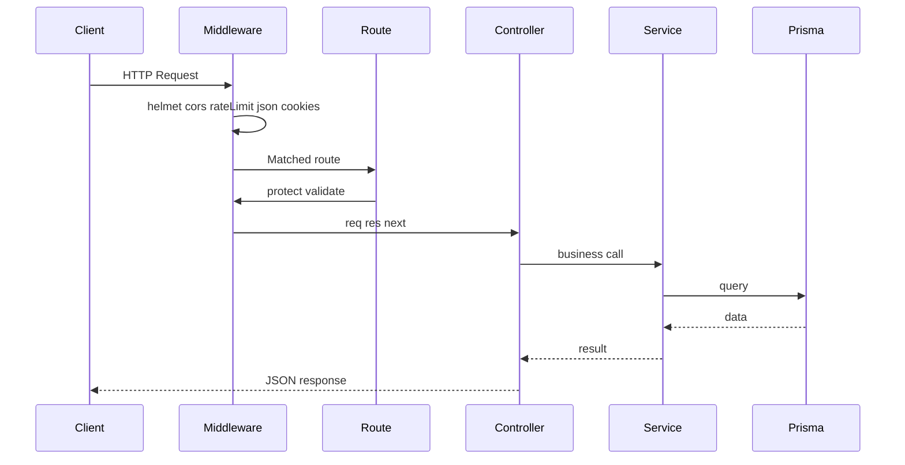

# 06 — API Guide

**Audience:** Beginners learning REST APIs and HTTP.  
**Prerequisites:** [01 — Full Architecture Guide](01_FULL_ARCHITECTURE_GUIDE.md), [05 — Database Guide](05_DATABASE_GUIDE.md)  
**What you will learn:** REST concepts, HTTP methods, status codes, and every OnePage API endpoint.

**Read next:** [07 — Security Guide](07_SECURITY_GUIDE.md)

---

## What Is an API?

### Definition
An **API** (Application Programming Interface) is a contract for how software components communicate. OnePage's **REST API** lets the frontend request data and actions over HTTP.

### Real-life analogy
A restaurant menu is an API: you order by name (endpoint), the kitchen prepares it (server logic), and you receive a plate (response).

### Base URL
All endpoints start with:
```
/api/v1
```

Version `v1` allows future breaking changes under `/api/v2` without breaking old clients.

---

## REST

### Definition
**REST** (Representational State Transfer) uses HTTP methods on **resources** (nouns like `/pages`, `/profile`).

| Method | Purpose | Idempotent? |
|--------|---------|-------------|
| GET | Read data | Yes |
| POST | Create or action | No |
| PUT | Replace/update resource | Yes |
| PATCH | Partial update | No |
| DELETE | Remove resource | Yes |

OnePage primarily uses GET, POST, and PUT.

---

## HTTP Status Codes

| Code | Meaning | When OnePage uses it |
|------|---------|----------------------|
| 200 | OK | Successful read or update |
| 201 | Created | Registration success |
| 400 | Bad Request | Validation failed (Zod) |
| 401 | Unauthorized | Missing or invalid JWT |
| 403 | Forbidden | Not admin |
| 404 | Not Found | Page, user, or route missing |
| 409 | Conflict | Slug already taken |
| 429 | Too Many Requests | Rate limit exceeded |
| 500 | Server Error | Unexpected failure |

---

## Standard Response Format

From [`server/src/utils/response.js`](../server/src/utils/response.js):

```json
{
  "success": true,
  "message": "Human-readable message",
  "data": { },
  "errors": null
}
```

On validation failure, `success` is false and `errors` may contain Zod issue details (development only).

---

## Authentication on Requests

**Protected routes** require a valid JWT, sent via:

1. **Cookie** `jwt` (primary — browser uses `credentials: 'include'`)
2. **Header** `Authorization: Bearer <token>` (alternative for tools like Postman)

Public routes (health, login, register, public page, analytics view, contact) do not require auth.

---

## Endpoint Reference

### GET `/api/v1/health`

| | |
|---|---|
| **Auth** | Public |
| **Purpose** | Verify API is running |
| **Frontend** | Not called by UI; useful for monitoring |

**Response 200:**
```json
{ "success": true, "message": "OnePage API v1 is running", "data": null }
```

---

### POST `/api/v1/auth/register`

| | |
|---|---|
| **Auth** | Public |
| **Purpose** | Create new user account |
| **Frontend** | [`client/scripts/api/auth.api.js`](../client/scripts/api/auth.api.js) |

**Request body:**
```json
{
  "email": "user@example.com",
  "password": "securepass",
  "confirmPassword": "securepass"
}
```

**Validation:** Email format, password min 8 chars, passwords must match.

**What happens:** Hashes password, creates User + Profile + Page, sets JWT cookie.

**Response 201:** User object (no password) in `data`.

**Errors:** 400 validation, 409 email exists.

---

### POST `/api/v1/auth/login`

| | |
|---|---|
| **Auth** | Public |
| **Purpose** | Sign in existing user |
| **Frontend** | `auth.api.js` |

**Request body:**
```json
{
  "email": "user@example.com",
  "password": "securepass"
}
```

**Response 200:** User + profile in `data`, JWT cookie set.

**Errors:** 401 invalid credentials.

---

### POST `/api/v1/auth/logout`

| | |
|---|---|
| **Auth** | Public (clears cookie even if expired) |
| **Purpose** | End session |
| **Frontend** | `auth.api.js`, dashboard sidebar |

**Request body:** None.

**Response 200:** Cookie cleared with `expires` in the past.

---

### GET `/api/v1/auth/me`

| | |
|---|---|
| **Auth** | JWT required |
| **Purpose** | Get current logged-in user |
| **Frontend** | [`authRedirect.js`](../client/scripts/utils/authRedirect.js) on every protected route |

**Response 200:** User with nested `profile` in `data`.

**Errors:** 401 no/invalid token.

---

### GET `/api/v1/pages/my`

| | |
|---|---|
| **Auth** | JWT required |
| **Purpose** | Get authenticated user's page with widgets |
| **Frontend** | `pages.api.js`, builder, dashboard |

**Response 200:** Page object with `widgets` array ordered by `order`.

---

### PUT `/api/v1/pages/my`

| | |
|---|---|
| **Auth** | JWT required |
| **Purpose** | Update page metadata (title, slug, theme) |
| **Frontend** | `pages.api.js`, appearance page, settings |

**Request body (all optional):**
```json
{
  "title": "My Portfolio",
  "slug": "jane-dev",
  "theme": "ocean",
  "description": "Optional description"
}
```

**Validation:** Slug lowercase alphanumeric + hyphens; theme must be valid enum.

**Errors:** 409 slug taken by another user.

---

### PUT `/api/v1/pages/my/widgets`

| | |
|---|---|
| **Auth** | JWT required |
| **Purpose** | Save all widgets (full replace) |
| **Frontend** | `pages.api.js`, builder save |

**Request body:**
```json
{
  "widgets": [
    {
      "type": "hero",
      "order": 0,
      "visible": true,
      "data": { "headline": "Hello", "subtitle": "World" }
    }
  ]
}
```

**What happens:** Transaction deletes old widgets, creates new ones.

**Response 200:** Updated page with widgets.

---

### GET `/api/v1/pages/`

| | |
|---|---|
| **Auth** | JWT + admin role |
| **Purpose** | List all pages (admin) |
| **Frontend** | Admin tooling (limited UI) |

**Response 200:** Array of pages.

---

### GET `/api/v1/pages/:slug`

| | |
|---|---|
| **Auth** | Public |
| **Purpose** | Fetch public page for visitors |
| **Frontend** | `pages.api.js`, [`public.page.js`](../client/scripts/pages/public.page.js) |

**URL param:** `slug` — e.g. `jane-dev`

**Response 200:** Page + widgets (no password fields).

**Errors:** 404 slug not found.

---

### GET `/api/v1/profile/me`

| | |
|---|---|
| **Auth** | JWT required |
| **Purpose** | Get current user's profile |
| **Frontend** | `profile.api.js`, settings |

---

### PUT `/api/v1/profile/me`

| | |
|---|---|
| **Auth** | JWT required |
| **Purpose** | Update profile fields |
| **Frontend** | `profile.api.js`, settings |

**Request body (optional fields):** fullName, username, jobTitle, bio, avatar, resume, email, phone, location, website.

---

### POST `/api/v1/analytics/view/:slug`

| | |
|---|---|
| **Auth** | Public |
| **Purpose** | Record one page view for today |
| **Frontend** | `analytics.api.js`, public page load |

**What happens:** Finds page by slug, increments or creates `AnalyticsRecord` for today's date.

**Response 200:** Success (fire-and-forget on frontend).

---

### GET `/api/v1/analytics/my`

| | |
|---|---|
| **Auth** | JWT required |
| **Purpose** | Get owner's analytics summary |
| **Frontend** | `analytics.api.js`, dashboard, analytics page |

**Response 200:**
```json
{
  "data": {
    "labels": ["Mon", "Tue", ...],
    "views": [3, 5, 2, ...],
    "totalViews": 10,
    "widgetCount": 6
  }
}
```

---

### GET `/api/v1/admin/users`

| | |
|---|---|
| **Auth** | JWT + admin |
| **Purpose** | List all users |
| **Frontend** | [`admin.page.js`](../client/scripts/pages/admin.page.js) |

**Response 200:** Array of users (email, role, createdAt, profile).

**Errors:** 403 non-admin.

---

### POST `/api/v1/upload/image`

| | |
|---|---|
| **Auth** | JWT required |
| **Purpose** | Upload image for widgets |
| **Frontend** | [`upload.api.js`](../client/scripts/api/upload.api.js) |

**Request:** `multipart/form-data` with field `image` (not JSON).

**Limits:** 5MB max; JPEG, PNG, WebP only.

**Response 200:**
```json
{ "data": { "url": "https://res.cloudinary.com/... or /uploads/uuid.jpg" } }
```

---

### POST `/api/v1/ai/bio`

| | |
|---|---|
| **Auth** | JWT required |
| **Purpose** | Generate bio text via OpenAI |
| **Frontend** | Builder/properties (when configured) |

**Request body:**
```json
{ "prompt": "Software engineer who loves open source" }
```

**Requires:** `OPENAI_API_KEY` in environment. Returns error if missing.

---

### POST `/api/v1/export/`

| | |
|---|---|
| **Auth** | JWT required |
| **Purpose** | Export page as ZIP download |
| **Frontend** | Builder export button |

**Request body:**
```json
{
  "html": "<div>...rendered page HTML...</div>",
  "theme": "light"
}
```

**Response:** Binary ZIP stream (not JSON).

---

### GET `/api/v1/onboarding/status`

| | |
|---|---|
| **Auth** | JWT required |
| **Purpose** | Check if onboarding is complete |
| **Frontend** | `onboarding.api.js` |

**Response 200:** `{ completed, profile, page }`

---

### POST `/api/v1/onboarding/complete`

| | |
|---|---|
| **Auth** | JWT required |
| **Purpose** | Finish onboarding, seed widgets |
| **Frontend** | `onboarding.api.js` |

**Request body:**
```json
{
  "fullName": "Jane Doe",
  "jobTitle": "Developer",
  "slug": "jane-doe",
  "theme": "ocean"
}
```

**What happens:** Updates profile, sets slug/theme, creates starter widgets, marks `onboardingCompleted: true`.

**Errors:** 409 slug taken, 400 already completed.

---

### POST `/api/v1/contact/:slug`

| | |
|---|---|
| **Auth** | Public |
| **Purpose** | Submit contact form on public page |
| **Frontend** | [`contact.api.js`](../client/scripts/api/contact.api.js) |

**Rate limit:** 10 requests per hour per IP (stricter than global API limit).

**Request body:**
```json
{
  "name": "Visitor",
  "email": "visitor@example.com",
  "content": "I'd like to work with you"
}
```

**What happens:** Saves Message to database; sends email via SMTP if configured.

---

## Request Flow Diagram



---

## Frontend API Client

[`client/scripts/api/http.js`](../client/scripts/api/http.js):

- Prefixes endpoints with `/api/v1`
- Sets `credentials: 'include'` for cookies
- 30-second timeout
- Throws user-friendly errors on failure

Domain modules wrap `http.get/post/put`:
- `auth.api.js`, `pages.api.js`, `profile.api.js`, `analytics.api.js`, `admin.api.js`, `onboarding.api.js`
- `upload.api.js` and `contact.api.js` use raw `fetch` for multipart/special cases

---

## Key Takeaways

- REST API at `/api/v1` with consistent JSON response shape
- GET reads, POST creates/actions, PUT updates
- JWT cookie authenticates protected routes
- 22 endpoints cover auth, pages, profile, analytics, admin, upload, AI, export, onboarding, contact

---

## Mini Exercise

Use browser DevTools or Postman to call `GET /api/v1/health`. Then log in and find the `Set-Cookie` header on the login response.
