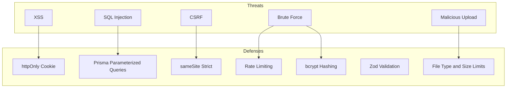

# 07 — Security Guide

**Audience:** Beginners learning web application security.  
**Prerequisites:** [04 — Backend Guide](04_BACKEND_GUIDE.md), [06 — API Guide](06_API_GUIDE.md)  
**What you will learn:** How OnePage protects passwords, sessions, input, and files against common attacks.

**Read next:** [08 — UI/UX Guide](08_UI_UX_GUIDE.md)

---

## Security Mindset

**Security** means protecting data and users from unauthorized access, tampering, and abuse. OnePage implements multiple layers — no single technique is enough.

---

## Passwords and Hashing

### Definition
**Hashing** transforms a password into a fixed-length string that cannot be reversed to recover the original password.

### bcrypt
OnePage uses **bcrypt** with cost factor **10** in [`authService.js`](../server/src/services/authService.js):

```javascript
const hashedPassword = await bcrypt.hash(password, 10);      // register
const isMatch = await bcrypt.compare(password, user.password); // login
```

### Why hash
If the database is stolen, attackers get hashes — not plain passwords. bcrypt is slow by design to resist brute-force guessing.

### Common mistakes
- Storing plain-text passwords
- Using fast hashes (MD5, SHA1) for passwords
- Returning password field in API responses (OnePage deletes it before responding)

### Interview question
*"Why not encrypt passwords?"* Encryption is reversible with a key. Hashing is one-way. Passwords should never be recoverable.

---

## JWT (JSON Web Token)

### Structure
`header.payload.signature` — payload contains `{ id, role }`, signed with `JWT_SECRET`.

### OnePage usage
- Created on login/register
- Verified on every protected request
- Expires after 7 days

### Risks
- If `JWT_SECRET` leaks, anyone can forge tokens
- Stolen token = impersonation until expiry

**Mitigation:** Strong secret in production (`JWT_SECRET` env var), httpOnly cookie storage.

---

## Cookies vs localStorage

| Storage | JS can read? | XSS risk | OnePage uses |
|---------|--------------|----------|--------------|
| localStorage | Yes | High — stolen by malicious script | No |
| httpOnly cookie | No | Lower — not accessible to JS | Yes (`jwt`) |

Frontend [`http.js`](../client/scripts/api/http.js) uses `credentials: 'include'` to send cookies automatically.

---

## Cookie Security Flags

```javascript
{
  httpOnly: true,      // No document.cookie access
  sameSite: 'strict',  // Not sent on cross-site requests
  secure: production,  // HTTPS only in production
  maxAge: 7 days
}
```

---

## Authentication vs Authorization

| | Authentication | Authorization |
|---|----------------|---------------|
| Question | Who are you? | What may you do? |
| OnePage | JWT + `protect` | `requireAdmin`, ownership checks |

Example: A logged-in user cannot edit another user's page — service layer checks `page.userId`.

---

## Input Validation

### Zod schemas
Every user input is validated before processing:

- Email format, password length
- Slug regex `^[a-z0-9-]+$`
- Widget array structure

Prevents malformed data from reaching the database or causing unexpected errors.

---

## XSS (Cross-Site Scripting)

### Definition
**XSS** is when an attacker injects malicious JavaScript that runs in another user's browser.

### OnePage mitigations
- Widget content rendered via `textContent` or escaped templates where possible
- httpOnly JWT — scripts cannot steal token from cookies
- Helmet sets security headers

### Remaining risk
If user-entered HTML is rendered unsafely, XSS is possible. Review widget `render()` methods when adding rich text.

---

## SQL Injection

### Definition
**SQL injection** inserts malicious SQL through user input.

### OnePage mitigation
**Prisma** uses parameterized queries — user input never concatenated into raw SQL strings.

```javascript
// Safe — Prisma parameterizes
await prisma.user.findUnique({ where: { email: userInput } });
```

---

## CSRF (Cross-Site Request Forgery)

### Definition
**CSRF** tricks a logged-in user's browser into making unwanted requests to your site.

### OnePage mitigations
- `sameSite: 'strict'` on JWT cookie
- CORS allowlist — only trusted origins with credentials

### Note
Strict sameSite may break cross-subdomain setups. OnePage serves SPA and API from same origin in production.

---

## Rate Limiting

### Global API limit
100 requests per 15 minutes per IP on `/api` ([`app.js`](../server/src/app.js)).

### Contact form limit
10 submissions per hour per IP ([`contactRoutes.js`](../server/src/routes/contactRoutes.js)).

### Why
Slows brute-force login attempts, spam contact forms, and API abuse.

---

## Environment Variables and Secrets

### Never commit
- `JWT_SECRET`
- `DATABASE_URL`
- `CLOUDINARY_SECRET`
- `OPENAI_API_KEY`
- `SMTP_PASS`

Use [`server/.env`](../server/.env.example) locally; platform dashboard on Render.

### Production warning
[`jwt.js`](../server/src/config/jwt.js) warns if `JWT_SECRET` is missing. [`index.js`](../index.js) generates a temporary secret on Render if unset — sessions reset on redeploy.

---

## File Upload Security

| Control | Value |
|---------|-------|
| Auth required | Yes |
| Max size | 5 MB |
| Allowed types | JPEG, PNG, WebP |
| Filename | Random UUID |
| Storage | Cloudinary or isolated uploads folder |

Prevents executable uploads and disk exhaustion.

---

## CORS

```javascript
cors({
  origin: production ? [CLIENT_URL] : devOrigins,
  credentials: true,
});
```

Only listed origins may send credentialed requests. Blocks random websites from calling your API with user cookies.

---

## Helmet

Sets HTTP security headers (X-Content-Type-Options, etc.). Reduces common browser-side attacks.

---

## Attack Surface Map



---

## Key Takeaways

- Passwords hashed with bcrypt; never stored or returned in plain text
- JWT in httpOnly, sameSite cookies — not localStorage
- Zod validates input; Prisma prevents SQL injection
- Rate limiting, Helmet, CORS, and upload restrictions add defense in depth

---

## Mini Exercise

List three things an attacker could try on the login form and which defense stops each.
