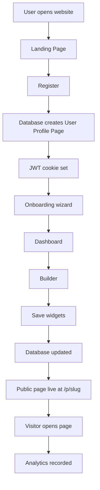
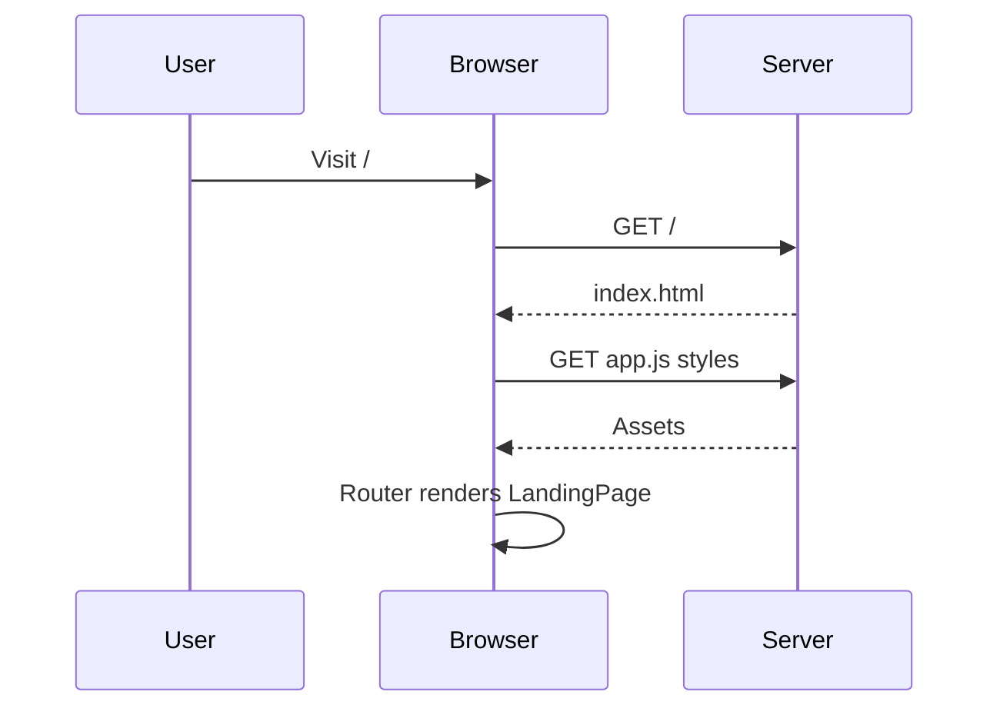
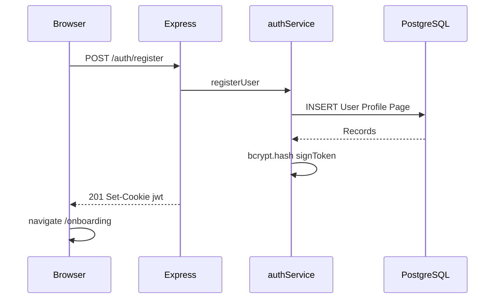
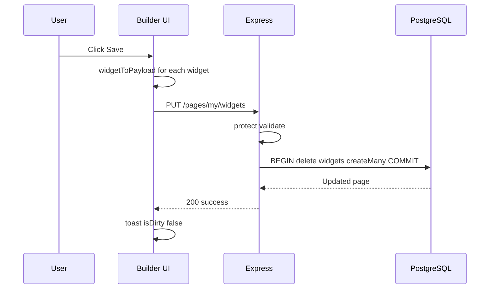
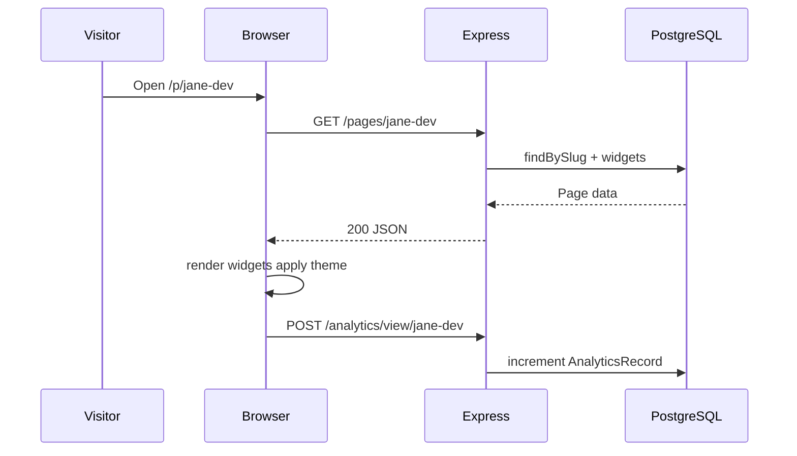

# 09 — Complete Project Flow

**Audience:** Beginners who want end-to-end understanding.  
**Prerequisites:** [03 — Frontend Guide](03_FRONTEND_GUIDE.md), [04 — Backend Guide](04_BACKEND_GUIDE.md), [06 — API Guide](06_API_GUIDE.md)  
**What you will learn:** Every step from opening the website to recording analytics, with HTTP requests traced.

**Read next:** [10 — Deployment Guide](10_DEPLOYMENT_GUIDE.md)

---

## Flow Overview

---

## 1. User Opens Website (Landing Page)

### Browser
1. `GET /` → Express serves `index.html` (or Vite in dev)
2. Loads CSS, Lucide icons, `app.js`
3. Router matches `/` → `LandingPage.render()`
4. `requireGuest` middleware: if already logged in → redirect

### HTTP requests
| Method | URL | Auth | Handler |
|--------|-----|------|---------|
| GET | `/` | None | Static file / SPA |
| GET | `/scripts/app.js` | None | Static |
| GET | CSS files | None | Static |

No API call until user interacts with auth.

---

## 2. Register

### User action
Fills email, password, confirm password → Submit.

### Frontend
[`register.page.js`](../client/scripts/pages/register.page.js) → `authApi.register(body)`

### HTTP
| Method | URL | Body |
|--------|-----|------|
| POST | `/api/v1/auth/register` | email, password, confirmPassword |

### Backend chain
1. `validate(registerSchema)` — Zod
2. `authController.register`
3. `authService.registerUser` — hash password
4. `userRepository.createWithProfileAndPage` — creates User, Profile, Page in DB
5. `signToken` → Set `jwt` cookie
6. Response 201 with user data

### Database tables touched
- `User` — INSERT
- `Profile` — INSERT (username from email + random suffix)
- `Page` — INSERT (default slug, light theme)

---

## 3. Onboarding

### Steps
1. About you (fullName, jobTitle)
2. Choose slug
3. Pick theme
4. Preview → Launch

### HTTP on complete
| Method | URL | Body |
|--------|-----|------|
| POST | `/api/v1/onboarding/complete` | fullName, jobTitle, slug, theme |

### Backend
1. `onboardingService.complete`
2. Check slug unique
3. UPDATE `Profile` — set bio, `onboardingCompleted: true`
4. UPDATE `Page` — slug, themeName, title
5. `buildStarterWidgets` → `pageRepository.saveWidgets`
6. INSERT 6 `Widget` rows

### Frontend
Redirects to `/dashboard` with `sessionStorage` flag for success toast.

---

## 4. JWT Session (Ongoing)

Every protected page runs `requireOnboarded` → `refreshAuthUser()`:

| Method | URL |
|--------|-----|
| GET | `/api/v1/auth/me` |

Cookie `jwt` sent automatically. Server verifies, returns user + profile.

---

## 5. Dashboard Load

### Frontend
[`dashboard.page.js`](../client/scripts/pages/dashboard.page.js) `afterRender`:

| Method | URL | Purpose |
|--------|-----|---------|
| GET | `/api/v1/pages/my` | Page + widgets |
| GET | `/api/v1/analytics/my` | View stats |

### Display
- Total views (7 days)
- Widget count
- Public link `/p/{slug}` with copy button
- Theme summary

---

## 6. Builder

### Load
| Method | URL |
|--------|-----|
| GET | `/api/v1/pages/my` |

Creates widget instances via `createWidget(type, data)`, renders to canvas.

### Edit widget
- Click widget → properties panel from `getPropertiesSchema()`
- Image field → `POST /api/v1/upload/image` (multipart)
- Optional AI bio → `POST /api/v1/ai/bio`

### Save
| Method | URL | Body |
|--------|-----|------|
| PUT | `/api/v1/pages/my/widgets` | `{ widgets: [...] }` |

### Backend
`pageRepository.saveWidgets` — transaction: delete all widgets, createMany new.

---

## 7. Appearance (Theme Change)

| Method | URL | Body |
|--------|-----|------|
| PUT | `/api/v1/pages/my` | `{ theme: "forest" }` |

Updates `Page.themeName`. Public page reflects on next visit.

---

## 8. Public Page Live

User's page is available at `/p/{slug}` without authentication.

---

## 9. Visitor Opens Public Page

### Frontend
[`public.page.js`](../client/scripts/pages/public.page.js):

| Method | URL | Auth |
|--------|-----|------|
| GET | `/api/v1/pages/:slug` | None |

### Render flow
1. Apply `applyPublicTheme(themeName)`
2. Create each widget, append to DOM
3. Contact widget: `live = true` — form enabled
4. Other widgets: read-only
5. Stagger animations

---

## 10. Analytics

### Record (every public visit)
| Method | URL |
|--------|-----|
| POST | `/api/v1/analytics/view/:slug` |

`analyticsRepository.recordView` — upsert today's row, increment `views`.

### Owner views stats
| Method | URL |
|--------|-----|
| GET | `/api/v1/analytics/my` |

Returns last 7 days labels, view counts, total.

---

## 11. Contact Form (Visitor)

Visitor submits on live contact widget:

| Method | URL | Body |
|--------|-----|------|
| POST | `/api/v1/contact/:slug` | name, email, content |

1. Validate with Zod
2. Rate limit (10/hr)
3. INSERT `Message`
4. Send email via SMTP if configured

---

## 12. Login (Returning User)

| Method | URL |
|--------|-----|
| POST | `/api/v1/auth/login` |

Same cookie flow as register. `requireOnboarded` checks `onboardingCompleted` → dashboard or onboarding.

---

## 13. Logout

| Method | URL |
|--------|-----|
| POST | `/api/v1/auth/logout` |

Clears `jwt` cookie. Frontend navigates to `/`.

---

## 14. Export

From builder:

| Method | URL | Body |
|--------|-----|------|
| POST | `/api/v1/export/` | html, theme |

Returns ZIP binary. User downloads `my-onepage-site.zip`.

---

## Complete Registration-to-Visit Table

| Step | User action | HTTP | DB tables |
|------|-------------|------|-----------|
| 1 | Open site | GET /, assets | — |
| 2 | Register | POST /auth/register | User, Profile, Page |
| 3 | Onboarding | POST /onboarding/complete | Profile, Page, Widget |
| 4 | Dashboard | GET /auth/me, /pages/my, /analytics/my | Read |
| 5 | Edit builder | GET /pages/my | Read |
| 6 | Upload image | POST /upload/image | — (Cloudinary/disk) |
| 7 | Save | PUT /pages/my/widgets | Widget |
| 8 | Share link | — | — |
| 9 | Visitor views | GET /pages/:slug | Read |
| 10 | Analytics | POST /analytics/view/:slug | AnalyticsRecord |
| 11 | Contact | POST /contact/:slug | Message |

---

## Key Takeaways

- Every user journey maps to specific HTTP requests and database operations
- JWT cookie authenticates dashboard flows; public routes are open
- Widget save replaces all widgets in one transaction
- Analytics and contact are fire-and-forget from the visitor's perspective

---

## Mini Exercise

Draw your own sequence diagram for the login → builder → save → public view path. Label every API call.
