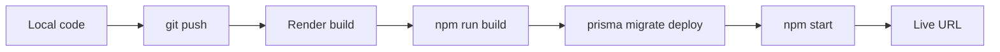

# 10 — Deployment Guide

**Audience:** Beginners learning how web applications go live on the internet.  
**Prerequisites:** [01 — Full Architecture Guide](01_FULL_ARCHITECTURE_GUIDE.md), [09 — Complete Project Flow](09_COMPLETE_PROJECT_FLOW.md)  
**What you will learn:** Hosting concepts and how to deploy OnePage to production.

**Read next:** [11 — Git Guide](11_GIT_GUIDE.md)

---

## What Is Hosting?

### Definition
**Hosting** means running your application on a computer connected to the internet 24/7 so other people can access it.

### Real-life analogy
Hosting is like renting a storefront. Your code is the merchandise; the host provides the building, electricity, and address.

---

## What Is a Server?

A **server** is a computer (physical or virtual) that listens for HTTP requests and responds. OnePage's server is a Node.js process running Express.

In production: `npm start` → [`index.js`](../index.js) → migrations → Express on port 3000 (or `PORT` env var).

---

## Hosting Options

| Type | Description | OnePage fit |
|------|-------------|-------------|
| **Shared hosting** | Many sites on one server; often PHP-only | Poor — needs Node.js |
| **VPS** (Virtual Private Server) | You manage the whole machine | Good — full control, more work |
| **PaaS** (Platform as a Service) | Provider manages server; you deploy code | **Best for beginners** |

---

## PaaS Providers

### Railway
Cloud platform for apps and databases. Simple Git deploy.

### Render
Similar to Railway. OnePage includes [`render.yaml`](../render.yaml) for one-click setup.

### Vercel / Netlify
Excellent for static sites and serverless functions. OnePage's **combined** Express + SPA model fits better on Render/Railway than split deployment for beginners.

### When to use Vercel
Frontend-only or Next.js apps. OnePage could split client to Vercel and API elsewhere — adds complexity.

---

## Cloudflare

**Cloudflare** provides DNS, CDN, DDoS protection, and SSL. You can put Cloudflare in front of Render for caching and custom domain management.

---

## Domain and DNS

### Domain
A **domain** is your human-readable address: `myportfolio.com`.

### DNS (Domain Name System)
**DNS** translates domain names to IP addresses. You add records at your registrar:

| Record | Purpose |
|--------|---------|
| A / CNAME | Point domain to Render URL |
| TXT | Verification for email/SSL |

Render provides a hostname like `onepage.onrender.com`. Custom domain: add CNAME in DNS settings.

---

## HTTPS and SSL

### HTTPS
**HTTPS** encrypts traffic between browser and server.

### SSL/TLS certificate
**SSL** certificate proves your site's identity. Render and Cloudflare provide free certificates automatically.

OnePage sets `secure: true` on cookies in production — requires HTTPS.

---

## Nginx (Advanced)

**Nginx** is a **reverse proxy** — sits in front of your app, handles SSL, static files, load balancing.

On PaaS (Render), you don't need Nginx — the platform handles it. On a VPS, you'd install Nginx to proxy port 443 → your Node app on 3000.

---

## PM2 (Advanced)

**PM2** keeps Node.js processes alive — restarts on crash, cluster mode.

On Render, the platform manages process lifecycle. On VPS: `pm2 start index.js`.

---

## Deploying OnePage to Render

### What render.yaml does
[`render.yaml`](../render.yaml):

1. Creates **PostgreSQL** database (`onepage-db`)
2. Creates **web service** running Node
3. Links `DATABASE_URL` from database to web service
4. Auto-generates `JWT_SECRET`

### Build command
```bash
npm install --include=dev && rm -f server/.env server/prisma/.env && npm run build
```

- Installs dependencies
- Removes local env files (important!)
- Builds Vite client + generates Prisma client

### Start command
```bash
npm start
```

Runs [`index.js`](../index.js):
1. Load env from Render dashboard
2. Run `prisma migrate deploy` (with retries)
3. Start Express serving API + `client/dist`

### Environment variables (Render dashboard)

| Variable | Source |
|----------|--------|
| `DATABASE_URL` | Auto from Postgres |
| `JWT_SECRET` | Auto-generated |
| `NODE_ENV` | `production` |
| `CLIENT_URL` | Your Render URL or custom domain |
| `CLOUDINARY_*` | Optional |
| `OPENAI_API_KEY` | Optional |
| `SMTP_*` | Optional |

---

## Deployment Flow



---

## How Updates Work

1. Make changes locally
2. Test with `npm run dev`
3. Commit and push to GitHub
4. Render detects push → rebuilds → runs migrations → restarts server
5. Users get new version on next page load (hard refresh if cached)

---

## Environment Variables in Production

### Rules
- Set secrets in platform dashboard, never in Git
- `CLIENT_URL` must match your public URL (CORS)
- On Render, local `server/.env` is deleted during build

### DATABASE_URL
Must be PostgreSQL connection string. [`resolveDatabaseUrl.js`](../server/src/config/resolveDatabaseUrl.js) validates and adds SSL params for hosted Postgres.

---

## Production Checklist

- [ ] `npm run build` succeeds locally
- [ ] `JWT_SECRET` set to strong random value
- [ ] `DATABASE_URL` points to PostgreSQL
- [ ] `CLIENT_URL` matches deployed URL
- [ ] Migrations apply (`prisma migrate deploy`)
- [ ] Optional: Cloudinary, SMTP, OpenAI configured
- [ ] Test register → onboarding → public page on live URL

---

## Common Deployment Problems

| Problem | Cause | Fix |
|---------|-------|-----|
| Blank page | `client/dist` missing | Run build in deploy command |
| CORS errors | Wrong `CLIENT_URL` | Match exact production URL |
| 401 on all routes | Cookie secure mismatch | Use HTTPS |
| Migration fails | DB not ready | Retries in index.js; check Render DB status |
| Sessions reset | JWT_SECRET changes on redeploy | Set stable JWT_SECRET in dashboard |

---

## Key Takeaways

- **PaaS (Render)** is the recommended path for OnePage
- One process serves API + built SPA in production
- `index.js` migrates database before starting server
- HTTPS, env vars, and correct CLIENT_URL are essential

---

## Mini Exercise

List every difference between `npm run dev` and `npm start` in terms of servers, ports, and file serving.
