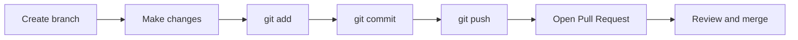

# 11 — Git Guide

**Audience:** Beginners learning version control.  
**Prerequisites:** None (standalone chapter)  
**What you will learn:** Git, GitHub, and how to manage the OnePage project with version control.

**Read next:** [12 — Debugging Guide](12_DEBUGGING_GUIDE.md)

---

## What Is Version Control?

### Definition
**Version control** tracks changes to files over time. You can see history, revert mistakes, and collaborate without overwriting each other.

### Git
**Git** is the most popular version control system. It runs locally on your machine.

### GitHub
**GitHub** is a website that hosts Git repositories online. It enables backup, collaboration, and deployment triggers (Render connects to GitHub).

---

## Core Concepts

| Term | Definition |
|------|------------|
| **Repository (repo)** | Project folder tracked by Git |
| **Commit** | Snapshot of changes with a message |
| **Branch** | Independent line of development |
| **Merge** | Combine branch changes into another branch |
| **Clone** | Copy a remote repo to your machine |
| **Fork** | Copy someone else's repo to your GitHub account |
| **Pull Request (PR)** | Request to merge your branch; enables code review |

---

## OnePage Repository Structure

```
OnePage/          ← Git root (one repository)
├── client/       ← Tracked
├── server/       ← Tracked
├── docs/         ← Tracked
├── node_modules/ ← NOT tracked (.gitignore)
├── client/dist/  ← NOT tracked (.gitignore)
└── server/.env   ← NOT tracked (secrets!)
```

---

## Initial Setup

```bash
git clone https://github.com/your-username/OnePage.git
cd OnePage
npm install
cp server/.env.example server/.env
# Edit server/.env
cd server && npx prisma migrate dev && cd ..
npm run dev
```

---

## Daily Workflow



### Recommended branch strategy

| Branch | Purpose |
|--------|---------|
| `main` | Production-ready code |
| `feature/add-testimonials-widget` | New features |
| `fix/login-error-message` | Bug fixes |
| `docs/update-api-guide` | Documentation |

### Commands

```bash
# Start new feature
git checkout main
git pull
git checkout -b feature/my-feature

# Save work
git add client/scripts/pages/new.page.js
git commit -m "Add testimonials widget to builder"

# Share
git push -u origin feature/my-feature
```

---

## Commit Messages

Write clear, complete sentences describing **why**:

| Good | Bad |
|------|-----|
| `Fix slug validation on onboarding step 2` | `fix` |
| `Add ocean theme preview to appearance page` | `updated stuff` |
| `Document JWT cookie flow in security guide` | `docs` |

OnePage-style prefixes (optional): `feat:`, `fix:`, `docs:`, `refactor:`

---

## What NOT to Commit

From [`.gitignore`](../.gitignore):

- `node_modules/` — reinstall with `npm install`
- `client/dist/` — rebuild with `npm run build`
- `server/.env` — contains secrets
- `server/uploads/` — user-uploaded files (local dev)

**Never commit:** passwords, API keys, database URLs with real credentials.

---

## Pull Requests

### When to use
- Merging feature branches to `main`
- Getting feedback before deploy
- Running CI checks (if configured)

### PR description template
```markdown
## Summary
- Added X widget type to builder

## Test plan
- [ ] Register new user
- [ ] Add widget in builder
- [ ] Save and view public page
```

---

## Merge vs Rebase

| Merge | Rebase |
|-------|--------|
| Preserves branch history | Linear history |
| Safer for beginners | Advanced — rewrites history |
| Creates merge commit | No merge commit |

**Recommendation for students:** use **merge** via Pull Request on GitHub.

---

## Deploy Integration

Render watches `main` branch:
1. Push to `main`
2. Render builds and deploys automatically

Keep `main` stable — use feature branches for experiments.

---

## Handling Conflicts

When two people edit the same lines:

```bash
git pull
# CONFLICT in file.js
# Edit file to resolve
git add file.js
git commit -m "Resolve merge conflict in file.js"
```

---

## Useful Commands

| Command | Purpose |
|---------|---------|
| `git status` | See changed files |
| `git diff` | See line changes |
| `git log --oneline` | Compact history |
| `git stash` | Temporarily save uncommitted work |
| `git checkout -- file` | Discard changes to file |

---

## Forking for Learning

1. Fork OnePage on GitHub to your account
2. Clone your fork
3. Experiment freely
4. Optionally open PRs back to original (open source etiquette)

---

## Key Takeaways

- Git tracks history; GitHub hosts and enables collaboration
- Use branches for features; merge via Pull Request
- Never commit secrets or `node_modules`
- `main` branch triggers Render deployment

---

## Mini Exercise

Create a branch `docs/my-notes`, add a one-line note to a file, commit, and push. Do not merge — practice only.
