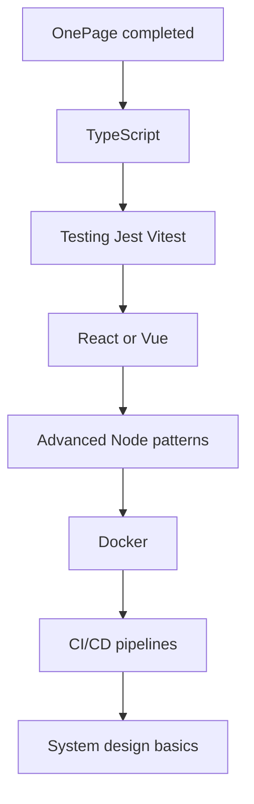

# 15 — Next Steps

**Audience:** Students who have studied the OnePage documentation and want to grow.  
**Prerequisites:** All prior chapters  
**What you will learn:** How to improve OnePage, what to learn next, and a post-project learning roadmap.

---

## Congratulations

If you have read this documentation carefully, you understand:

- Full-stack architecture (client, server, database)
- REST APIs and authentication
- A real layered backend pattern
- SPA routing and component-style widgets
- Database modeling with Prisma
- Security fundamentals
- Deployment basics

You can explain these decisions to another developer. That is a significant milestone.

---

## Feature Ideas

### Easy
| Feature | What to learn |
|---------|---------------|
| New widget type (Testimonials) | Widget registry, schema, CSS |
| Footer with social links | Layout component |
| Dark mode for app chrome | Extend theme system |
| Copy-to-clipboard toast improvements | DOM APIs |

### Medium
| Feature | What to learn |
|---------|---------------|
| Drag-and-drop widget reorder | HTML5 drag API or library |
| Custom domain per user | DNS, CNAME, env config |
| Email verification on register | Token table, email service |
| Read/unread inbox for Messages | New dashboard page |
| Password reset flow | Secure tokens, email |

### Advanced
| Feature | What to learn |
|---------|---------------|
| OAuth (Google/GitHub login) | Passport.js or similar |
| Real-time collaboration | WebSockets |
| Multi-page sites | Route + schema changes |
| Version history for widgets | Audit table, snapshots |
| Custom CSS per user | Sanitization, CSP |

---

## Refactoring Ideas

1. **Consistent service layer** — add services for upload, AI, export, admin
2. **Use or remove unused models** — wire Project/Skill to normalized tables OR drop from schema
3. **TypeScript migration** — start with `server/` or shared types
4. **Shared validation** — Zod schemas shared between client and server
5. **Structured logging** — Pino or Winston with log levels
6. **Test suite** — Vitest for frontend, Supertest for API routes
7. **Widget IDs** — upsert widgets by ID instead of delete-all/recreate-all

---

## Performance Improvements

| Area | Idea |
|------|------|
| Images | Responsive srcset, WebP conversion, lazy loading |
| API | Cache public page responses (short TTL) |
| Frontend | Code-split pages, lazy load Chart.js |
| Database | Index on `AnalyticsRecord(pageId, date)` |
| CDN | Cloudflare in front of static assets |
| Builder | Debounce auto-save |

---

## Security Improvements

- Refresh tokens + shorter access token expiry
- CSRF tokens for cookie-based mutations
- Content Security Policy (CSP) headers
- Rate limit login endpoint separately
- Account lockout after failed attempts
- Input sanitization library for rich text widgets
- Audit log for admin actions

---

## Scaling Ideas

| Stage | Approach |
|-------|----------|
| Small | Single Render instance (current) |
| Medium | Separate DB plan, Redis for sessions/cache |
| Large | Horizontal scaling behind load balancer, read replicas |
| Files | Always use Cloudinary or S3, not local disk |

**Load balancer** — distributes traffic across multiple server instances. Introduced when one server cannot handle all users.

---

## What to Learn Next

### Recommended order after OnePage



### 1. TypeScript
Static types catch bugs before runtime. Migrate OnePage server first — smallest surface.

**Resources:** TypeScript handbook, practice converting `authService.ts`

### 2. Automated Testing
- **Unit tests** — services, validators
- **Integration tests** — API routes with test database
- **E2E tests** — Playwright for register → builder flow

### 3. A Frontend Framework
**React** or **Vue** — component models you already understand from widgets. Try rebuilding one page.

### 4. Docker
Containerize OnePage for consistent dev/prod environments.

```dockerfile
# Conceptual — Node image, copy app, npm start
```

### 5. Redis
Caching, session storage, rate limiting at scale.

### 6. WebSockets
Real-time notifications, live analytics.

### 7. System Design
Read about CAP theorem, horizontal scaling, message queues. Build a second project with different architecture choices.

---

## Portfolio Presentation

When showing OnePage to employers:

1. **Live demo** — deployed Render URL
2. **Architecture diagram** — from [Chapter 01](01_FULL_ARCHITECTURE_GUIDE.md)
3. **Highlight decisions** — why JWT cookies, why JSON widgets, why Prisma
4. **Show code** — one clean vertical slice (e.g. widget save flow)
5. **Discuss tradeoffs** — what you'd improve with more time

---

## Open Source Contribution

- Fix README SQLite → PostgreSQL mention
- Add tests for auth flow
- Improve accessibility in builder
- Write more widget types
- Document API with OpenAPI/Swagger

---

## Second Project Suggestions

Build something **different** to round out skills:

| Project | New skills |
|---------|------------|
| Task manager with teams | WebSockets, permissions |
| E-commerce store | Payments (Stripe), inventory |
| Blog with comments | SSR (Next.js), markdown |
| Chat app | Real-time, message persistence |
| CLI tool | No browser, pure Node |

---

## Learning Roadmap (3–6 months)

| Month | Focus |
|-------|-------|
| 1 | TypeScript + tests on OnePage |
| 2 | React fundamentals, rebuild dashboard |
| 3 | Docker + CI (GitHub Actions) |
| 4 | New project from scratch with React + Prisma |
| 5 | Auth deep dive (OAuth, refresh tokens) |
| 6 | System design reading + mock interviews |

---

## Key Takeaways

- OnePage is a foundation, not a ceiling
- Improve incrementally: tests → types → features → scale
- Learn adjacent tools (TypeScript, React, Docker) in deliberate order
- Build a second project to prove transferable skills

---

## Mini Exercise

Pick one feature from "Easy" and one from "Medium." Write a one-paragraph design doc for each: files to change, API changes, and risks.
